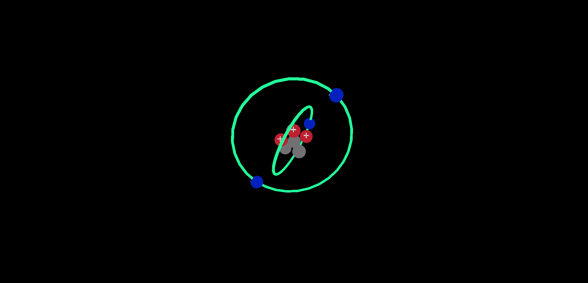

# 🌐 Atomic Energy Simulator

**Atomic Energy Simulator** é uma simulação interativa em 3D que representa a estrutura de um átomo de forma visual e dinâmica. Desenvolvido com **Three.js**, o projeto conta com **modelos 3D autorais criados no Blender**, exibindo o núcleo, as camadas de valência e a movimentação dos elétrons. Inclui também **efeitos visuais e sonoros** para enriquecer a experiência imersiva.

<p align="center">
  
</p>

<p align="center">
  <a href="https://jhoandev.github.io/AtomEnergySimulator/" target="_blank">
    🔗 Acesse a simulação ao vivo
  </a>
</p>

# 🧠 Arquitetura das Classes

## 🧱 `AtomStructure` — Prótons e Nêutrons

A classe `AtomStructure` representa uma **única partícula do núcleo** (próton ou nêutron), controlando seu carregamento 3D, movimentação até o centro e interação com as demais partículas do núcleo.

### 🔄 Construção da Partícula

```js
constructor(scene, type, core, radius = 0.35) {
  this.scene = scene;
  this.type = type;           // "proton" ou "neutron"
  this.core = core;           // referência ao núcleo (classe Core)
  this.radius = radius;       // escala do modelo
  this.fixed = false;         // se a partícula está parada
  this.position = new THREE.Vector3();
  this.velocity = new THREE.Vector3(0, 0, 0);
  this.load(this);            // inicia o carregamento do modelo 3D
}
```

### 📦 Carregamento do Modelo 3D

```js
load(object) {
  const loader = new GLTFLoader();
  loader.load(`src/models/${this.type}.gltf`, (gltf) => {
    object.model = gltf.scene.children[0];
    object.model.scale.set(this.radius, this.radius, this.radius);
    object.model.position.copy(this.position);
    this.scene.add(object.model);
  });
}
```

- O modelo `.gltf` é carregado com base no tipo da partícula (`proton` ou `neutron`)
- Aplicação de **escala e posição inicial**
- Adição direta à cena Three.js


### 🎯 Posicionamento

```js
setPosition(position) {
  this.position.copy(position);
  if (this.model) {
    this.model.position.copy(position);
  }
}
```

- Define a **posição tridimensional** inicial da partícula
- Também atualiza a posição visual se o modelo já estiver carregado


### 🌍 Simulação Gravitacional

```js
applyGravity() {
  if (!this.fixed) {
    const gravityDirection = new THREE.Vector3(0, 0, 0)
      .sub(this.position)
      .normalize();
    const gravityStrength = 0.01;
    this.velocity.add(gravityDirection.multiplyScalar(gravityStrength));
    this.position.add(this.velocity);

    if (this.model) {
      this.model.position.set(this.position);
    }

    this.checkCollision(); // Verifica proximidade com outras partículas
  }
}
```

- Aplica uma **força simulada de atração** para o centro da cena
- A partícula se move continuamente até ficar suficientemente próxima de outra


### 📏 Verificação de Proximidade

```js
checkCollision() {
  for (const atom of this.core.atoms) {
    if (atom !== this) {
      const distance = this.position.distanceTo(atom.position);
      if (distance < this.core.minDistance) {
        this.fixed = true;
        this.velocity.set(0, 0, 0);
      }
    }
  }
}
```

- **Não há colisão real**, apenas uma verificação de **distância mínima** entre partículas
- Quando a distância cai abaixo de `minDistance`, a partícula é fixada


### 🔁 Rotação Estética

```js
rotate() {
  if (this.model) {
    this.model.rotation.x += 0.01;
    this.model.rotation.y += 0.01;
  }
}
```

- Roda suavemente o modelo 3D em torno dos eixos X e Y
- Apenas visual, sem impacto na física


## 🧩 `Core` — Núcleo Atômico

A classe `Core` é responsável por organizar e posicionar os **prótons** e **nêutrons** no centro do átomo, simulando um empacotamento denso com verificação de colisão e aproximação gravitacional.

### 📦 Construtor

```js
new Core(scene, numberOfProtons, numberOfNeutrons, atomRadius)
```

| Parâmetro             | Descrição                                                                 |
|------------------------|---------------------------------------------------------------------------|
| `scene`               | A cena principal do Three.js                                               |
| `numberOfProtons`     | Quantidade de prótons a serem adicionados                                 |
| `numberOfNeutrons`    | Quantidade de nêutrons a serem adicionados                                |
| `atomRadius`          | Raio visual de cada partícula (default `0.35`)                             |

### 🧮 Cálculo do Raio do Núcleo

```js
calculateCoreRadius() {
  const packingFactor = 0.74;
  const totalParticles = this.numberOfNeutrons + this.numberOfProtons;
  return this.atomRadius * Math.pow(totalParticles / packingFactor, 1 / 3);
}
```

> 📐 Baseado na **teoria de empacotamento esférico**:  
> `r = r_atom * (N / packingFactor)^(1/3)`


### 🔄 Posicionamento das Partículas

#### 🎲 Geração de posição aleatória

```js
generateRandomPosition() {
  let x, y, z;
  do {
    x = (Math.random() - 0.5) * 2 * this.coreRadius;
    y = (Math.random() - 0.5) * 2 * this.coreRadius;
    z = (Math.random() - 0.5) * 2 * this.coreRadius;
  } while (Math.sqrt(x * x + y * y + z * z) > this.coreRadius);

  return new THREE.Vector3(x, y, z);
}
```

- Garante que a partícula esteja **dentro da esfera do núcleo**
- e não esteja colidindo com outra

#### ✅ Verificação de colisão com outras partículas

```js
isPositionValid(position) {
  for (const atom of this.atoms) {
    const distance = atom.position.distanceTo(position);
    if (distance < this.minDistance) return false;
  }
  return true;
}
```

- Verifica se a nova partícula está **longe o suficiente** das já existentes (sem colidir)


### ➕ Adição de partículas ao núcleo

```js
addParticles() {
  // Neutrons
  for (...) {
    ...
    if (i === 0) {
      position = new THREE.Vector3(0, 0, 0);
    }
    const neutron = new AtomStructure(this.scene, "neutron", this);
    if (i === 0) neutron.fixed = true;
    neutron.setPosition(position);
    this.atoms.push(neutron);
  }

  // Protons
  for (...) {
    ...
    const proton = new AtomStructure(this.scene, "proton", this);
    proton.setPosition(position);
    this.atoms.push(proton);
  }
}
```

- O **primeiro nêutron** é fixado no centro (`(0, 0, 0)`)
- Prótons e demais nêutrons são posicionados **aleatoriamente** sem colisão


### 📍 Verificação de estabilização do núcleo

```js
allAtomsFixed() {
  for (const atom of this.atoms) {
    if (!atom.fixed) {
      this.allAtomsIsFixed = false;
      return;
    }
  }
  this.allAtomsIsFixed = true;
}
```

- Verifica se **todas as partículas foram fixadas**
- Útil para saber quando parar de aplicar a gravidade la da classe Atom


### ⚙️ Atributos Relevantes

| Atributo              | Descrição                                                                 |
|------------------------|---------------------------------------------------------------------------|
| `this.atoms`          | Lista de todas as partículas do núcleo (`AtomStructure[]`)                |
| `this.coreRadius`     | Raio total do núcleo com base no empacotamento esférico                   |
| `this.minDistance`    | Distância mínima entre partículas para evitar sobreposição                |
| `this.allAtomsIsFixed`| `true` se todas as partículas estão fixas                                 |


## ⚛️ `Electron` — Elétron Individual

A classe `Electron` representa visualmente um **elétron isolado** e sua associação com uma **camada de valência** (`ValenceShell`). Cada elétron possui rotação estética contínua e pode ser removido da cena dinamicamente.

### 📦 Construtor

```js
new Electron(scene, valenceShell, radius)
```

| Parâmetro       | Descrição                                                             |
|------------------|-------------------------------------------------------------------------|
| `scene`         | A cena principal do Three.js                                            |
| `valenceShell`  | Referência à camada de valência à qual o elétron pertence              |
| `radius`        | Escala visual do modelo 3D do elétron (padrão `0.35`)                   |

---

### 🧩 Métodos

#### 📥 Carregamento do modelo `.gltf`

```js
load(object) {
  const loader = new GLTFLoader();
  loader.load(`src/models/electron.gltf`, (gltf) => {
    object.model = gltf.scene.children[0];
    object.model.scale.set(this.radius, this.radius, this.radius);
    object.model.position.copy(this.position);
    this.scene.add(object.model);
  });
}
```

- Utiliza `GLTFLoader` para carregar o modelo 3D do elétron
- Aplica escala e posição ao modelo
- Adiciona à cena principal

#### 📍 Definição de posição

```js
setPosition(position) {
  this.position.copy(position);
  if (this.model) {
    this.model.position.copy(position);
  }
}
```

- Define a posição espacial do elétron
- Atualiza o modelo 3D (se já carregado)

#### 💫 Rotação estética

```js
rotate() {
  if (this.model) {
    this.model.rotation.x += 0.1;
    this.model.rotation.y += 0.1;
  }
}
```

- Gira o modelo 3D continuamente para fins visuais

#### ❌ Remoção do modelo da cena

```js
remove() {
  if (this.model) {
    this.scene.remove(this.model);
  }
}
```

- Remove o elétron da cena

### ⚙️ Atributos Relevantes

| Atributo            | Descrição                                                          |
|----------------------|----------------------------------------------------------------------|
| `this.model`        | Modelo 3D carregado do elétron                                       |
| `this.position`     | Posição atual no espaço 3D                                           |
| `this.valenceShell` | Referência à camada orbital à qual o elétron pertence                |
| `this.radius`       | Escala visual aplicada ao modelo                                     |
| `this.angle`        | Ângulo usado para controle de órbita (inicialmente 0)               |
| `this.raioDeOrbita` | Raio da órbita onde o elétron se moverá (associado à `ValenceShell`) |


## 🧬 Camada de valência — ValenceShell 

A classe `ValenceShell` representa uma **camada de valência eletrônica tridimensional**, com visualização em forma de **anel orbital** (`TorusGeometry`) e movimentação circular de elétrons sobre um plano **orientado dinamicamente no espaço 3D**.


### 🎯 Objetivo da Classe

```js
constructor(scene, layer, normalVector, electronsQuantity)
```

Cada instância de `ValenceShell` recebe:

- `scene`: a cena Three.js onde o anel será renderizado
- `layer`: número da camada (ex: 1 = K, 2 = L)
- `normalVector`: vetor normal arbitrário que define a **inclinação 3D** do plano da camada
- `electronsQuantity`: quantidade de elétrons que orbitarão essa camada

---

### 🧭 Construção Matemática do Plano 3D

#### 1. Normalização do vetor normal

```js
this.planeNormal = new THREE.Vector3(...);
this.planeNormal.normalize();
```

- O vetor normal define **a orientação do plano orbital**.
- A normalização garante magnitude 1 — necessária para manter a direção pura, sem escalas.

#### 2. Cálculo da base vetorial ortonormal

```js
const arbitraryVector = new THREE.Vector3(1, 0, 0);
if (Math.abs(this.planeNormal.x) > 0.5) {
  arbitraryVector.set(0, 1, 0);
}

this.orthogonalVector1
  .crossVectors(this.planeNormal, arbitraryVector)
  .normalize();

this.orthogonalVector2
  .crossVectors(this.planeNormal, this.orthogonalVector1)
  .normalize();
```

- Calculamos dois vetores ortogonais ao plano, formando um **sistema ortonormal 3D**:  
  \{ `orthogonalVector1`, `orthogonalVector2`, `planeNormal` \}
- Esses vetores são usados para **posicionar os elétrons em rotação circular no plano definido.**


### 🌀 Geração e Orientação do Anel

```js
this.ring = new THREE.Mesh(new THREE.TorusGeometry(...));
this.ring.lookAt(this.planeNormal);
```

- O método `lookAt()` orienta o anel orbital perpendicularmente à normal.
- Para posicionar o anel sobre o plano definido por \( Ax + By + Cz + D = 0 \):

```js
this.D = -(A * x + B * y + C * z);
const distanceToOrigin = -this.D / this.planeNormal.length();
this.ring.position.copy(this.planeNormal.clone().multiplyScalar(distanceToOrigin));
```

> Isso posiciona o centro do anel exatamente sobre o plano inclinado no espaço 3D.

---

### ⚙️ Movimento Orbital dos Elétrons

```js
electron.angle += 0.03;
```

A cada frame, atualizamos a posição angular do elétron com combinação vetorial:

```js
position.x = cos(angle) * v1.x + sin(angle) * v2.x;
position.y = cos(angle) * v1.y + sin(angle) * v2.y;
position.z = cos(angle) * v1.z + sin(angle) * v2.z;
```

A fórmula completa:

```js
position = cos(θ) * orthogonalVector1 + sin(θ) * orthogonalVector2;
```

#### Suavização do raio — simulação de transição energética:

```js
electron.raioDeOrbita = 0.98 * electron.raioDeOrbita + 0.02 * this.radius;
```

Essa interpolação suaviza transições entre camadas, criando o efeito de **vibração energética** ou **salto quântico**.


### ⚡ Excitação do Elétron

Para simular a **absorção de energia** por um elétron, basta alterar temporariamente seu raio de órbita:

```js
electron.raioDeOrbita = this.radius + 1.2;
```

> Isso representa o **salto quântico do elétron** para um estado energético mais alto — ele se afasta do núcleo, movendo-se para uma camada superior.  
>  
> Porém, esse salto não é instantâneo na visualização. O método `rotateElectrons()` aplica um **filtro exponencial de suavização**, fazendo com que o elétron **transite gradualmente** até a nova órbita.  
>  
> Caso o elétron perca energia, o raio desejado retorna ao valor da camada atual, e o mesmo filtro faz com que ele **volte suavemente à camada original**, simulando a **desexcitação**.

---

### 📌 Extras Técnicos

- Independente dos planos XY, YZ, XZ — o sistema funciona em qualquer inclinação espacial.
- A movimentação é **vetorialmente precisa**, baseada em álgebra vetorial 3D.


## ▶️ Como Executar

```bash
git clone https://github.com/JhoanDev/AtomEnergySimulator.git
cd AtomEnergySimulator
npm install
npm run dev
```

Acesse no navegador:

```
http://localhost:5173
```


## 🚀 Tecnologias Utilizadas

| Tecnologia     | Descrição                                                                 |
|----------------|---------------------------------------------------------------------------|
| **Three.js**   | Biblioteca para renderização 3D baseada em WebGL                          |
| **JavaScript** | Toda a lógica do projeto foi construída com JavaScript puro               |
| **Blender**    | Modelagem 3D dos componentes atômicos com exportação em GLTF/BIN          |
| **Vite**       | Ferramenta leve e moderna de bundling para desenvolvimento em JS          |
| **HTML/CSS**   | Estrutura e estilização básica da interface do projeto                    |

## 📁 Estrutura de Arquivos

```
├── .gitignore
├── LICENSE
├── README.md
├── AtomEnergySimulator
│   ├── index.html
│   ├── main.js
│   ├── package.json
│   ├── style.css
│   ├── public
│   │   ├── atom.png
│   │   ├── soundOfEletric.mp3
│   │   └── soundOfLight.mp3
│   └── src
│       ├── atom
│       │   ├── AtomStructure.js
│       │   ├── Core.js
│       │   ├── Electron.js
│       │   └── ValenceShell.js
│       └── models
│           ├── electron.gltf/.bin
│           ├── neutron.gltf/.bin
│           └── proton.gltf/.bin
```

## 🎮 Funcionalidades

- Visualização 3D em tempo real da estrutura atômica
- Núcleo atômico com empacotamento de partículas (prótons e nêutrons)
- Elétrons orbitando em camadas orientadas tridimensionalmente
- Transição entre camadas com simulação de excitação
- Efeitos visuais e sonoros sincronizados com eventos energéticos


## 📌 Observações

- Toda a lógica é implementada em **JavaScript puro** (sem React ou frameworks).
- Modelos 3D foram feitos no **Blender** e exportados como `.gltf`/`.bin`.
- A aplicação é otimizada para navegadores modernos com suporte a **WebGL**.
- Sons de excitação estão disponíveis na pasta `public`.

